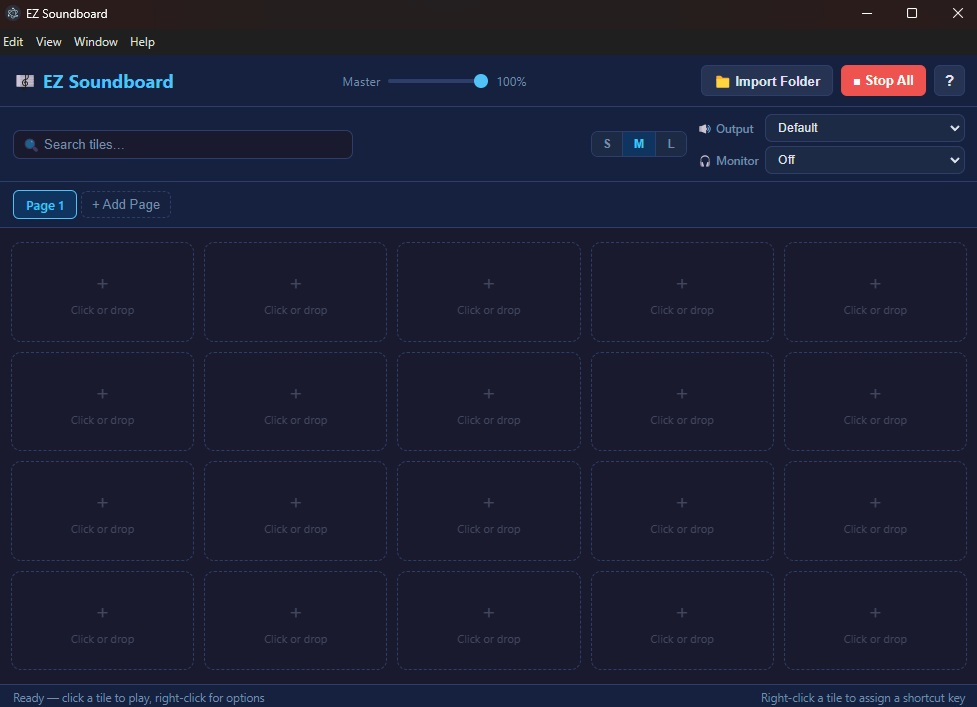

# EZ Soundboard

A lightweight desktop soundboard app built with Electron. Assign audio clips to tiles, organize them across pages, and route audio to Discord using a virtual audio cable.



---

## Download

**[⬇ Download latest release](https://github.com/Mootness/ez-soundboard/releases/latest)**

Extract the ZIP and run `EZSoundboard.exe` — no installation required.

---

## Features

- **Tiles & Pages** — Organize sounds across multiple named pages
- **Keyboard Shortcuts** — Assign a key to any tile for instant playback
- **Virtual Cable Support** — Route audio to Discord via VB-Cable (free)
- **Monitor Output** — Hear clips in your own headphones while Discord gets the primary output
- **Per-tile controls** — Individual volume, color labels, rename, and reassign
- **Import folder** — Bulk-add all audio files from a folder in one click
- **System tray** — Minimize to tray; app keeps running in the background
- **Tile sizes** — Switch between Small / Medium / Large grid layouts
- **Search** — Filter tiles by name instantly

---

## Discord Audio Routing Setup

Discord records your **microphone**, not your speakers. To send soundboard clips into Discord you need a virtual audio cable.

1. **Install VB-Cable** (free) — download from [vb-audio.com/Cable](https://vb-audio.com/Cable) and run the installer as Administrator
2. **In EZ Soundboard** — set Output to `CABLE Input (VB-Audio Virtual Cable)`, set Monitor to your headphones/speakers
3. **In Discord** — Settings → Voice & Video → Input Device → `CABLE Output (VB-Audio Virtual Cable)`

The in-app **Help** menu (Help → Discord & Audio Setup) walks through this step by step.

---

## Supported Audio Formats

MP3, WAV, OGG, FLAC, M4A, AAC, Opus, WebM

---

## Build From Source

**Requirements:** Node.js 18+

```bash
git clone https://github.com/Mootness/ez-soundboard.git
cd ez-soundboard
npm install
npm start          # Run in development
npm run build      # Package → dist/EZSoundboard-win-x64.zip
```

The build script packages the app with `electron-packager` and zips the output into `dist/EZSoundboard-win-x64.zip`.

---

## User Data

Your soundboard config and audio files are stored in:

- **Standalone EXE:** `EZSoundboard-data/` folder next to the EXE
- **Dev mode:** Windows `AppData\Roaming\ez-soundboard\`

---

## License

MIT — see [LICENSE](LICENSE)
