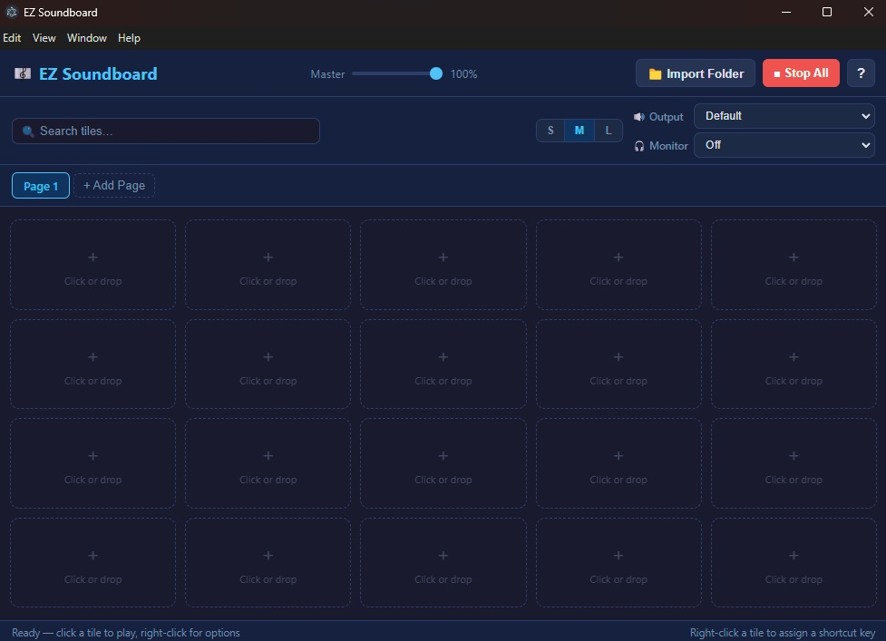

# EZ Soundboard

A lightweight desktop soundboard app built with Electron. Assign audio clips to tiles, organize them across pages, and route audio to Discord using a virtual audio cable.



---

## Download

**[⬇ Download latest release](https://github.com/Mootness/ez-soundboard/releases/latest)**

Run `EZ-Soundboard-Setup-<version>.exe` — it installs for your user account (no admin needed). The app checks for updates when it starts and offers to install new versions.

---

## Features

- **Tiles & Pages** — Organize sounds across multiple named pages
- **Keyboard Shortcuts** — Assign a key or combo (e.g. `Alt+1`, `Ctrl+Shift+F`) to any tile for instant playback
- **Global Hotkeys** — Optionally make shortcuts work while other apps (like games) are focused
- **Virtual Cable Support** — Route audio to Discord via VB-Cable (free)
- **Monitor Output** — Hear clips in your own headphones while Discord gets the primary output
- **Per-tile controls** — Individual volume, color labels, rename, and reassign
- **Import folder** — Bulk-add all audio files from a folder in one click
- **System tray** — Click the tray icon to hide or show the window; global hotkeys keep working while it's hidden
- **Tile sizes** — Switch between Small / Medium / Large grid layouts
- **Search** — Filter tiles by name instantly
- **Auto-updates** — New versions are offered in-app

---

## Keyboard Shortcuts

Right-click a tile → **Set shortcut key**, then press a key or hold Ctrl / Alt / Shift and press a key for a combo.

By default shortcuts only work while EZ Soundboard is the focused window. Turn on **Global hotkeys** in the toolbar to make them work everywhere — in a game, in Discord, anywhere. While it's on, the keys you bind are captured system-wide (pressing them won't type in other apps), so combos like `Alt+1` or numpad keys are the safest choices. If a combo is already used by another app, the status bar says so and that shortcut keeps working only while EZ Soundboard is focused.

---

## Discord Audio Routing Setup

Discord records your **microphone**, not your speakers. To send soundboard clips into Discord you need a virtual audio cable.

1. **Install VB-Cable** (free) — download from [vb-audio.com/Cable](https://vb-audio.com/Cable) and run the installer as Administrator
2. **In EZ Soundboard** — set Output to `CABLE Input (VB-Audio Virtual Cable)`, set Monitor to your headphones/speakers
3. **In Discord** — Settings → Voice & Video → Input Device → `CABLE Output (VB-Audio Virtual Cable)`

The in-app **Help** menu (Help → Discord & Audio Setup) walks through this step by step.

---

## Supported Formats

- **Audio:** MP3, WAV, OGG / OGA, Opus, FLAC, M4A, AAC, WebM / WEBA, MKA
- **Video** (plays the soundtrack): MP4, M4V, MOV, MKV, WebM, OGV, 3GP

Not supported: Apple Lossless (ALAC) `.m4a` files, and videos whose audio is AC3, E-AC3 or DTS (common in movie rips) — those play no sound, and the app tells you so.

---

## Build From Source

**Requirements:** Node.js 18+

```bash
git clone https://github.com/Mootness/ez-soundboard.git
cd ez-soundboard
npm install
npm start                # Run in development
npm run build            # Installer → dist/EZ-Soundboard-Setup-<version>.exe
npm run build:portable   # Single portable .exe that keeps its data next to itself
npm run publish          # Build and publish a GitHub release (needs GH_TOKEN)
```

Builds use `electron-builder`. The installer build also writes `dist/latest.yml`, which the in-app updater reads from the GitHub release.

---

## User Data

Your soundboard config (`soundboard.json`) is stored in:

- **Installed app and `npm start`:** `%APPDATA%\ez-soundboard\`
- **Portable build:** `EZSoundboard-data\` folder next to the exe

Audio files aren't copied — tiles point to your files where they are, so keep them in place.

---

## License

MIT — see [LICENSE](LICENSE)

---

## Support

[](https://ko-fi.com/mootness)
